# flutter_home_automation

Home automation controller app, designed and developed in Flutter.

## Screenshots

<ul style="float:left">
    <table>
        <tr>
            <td>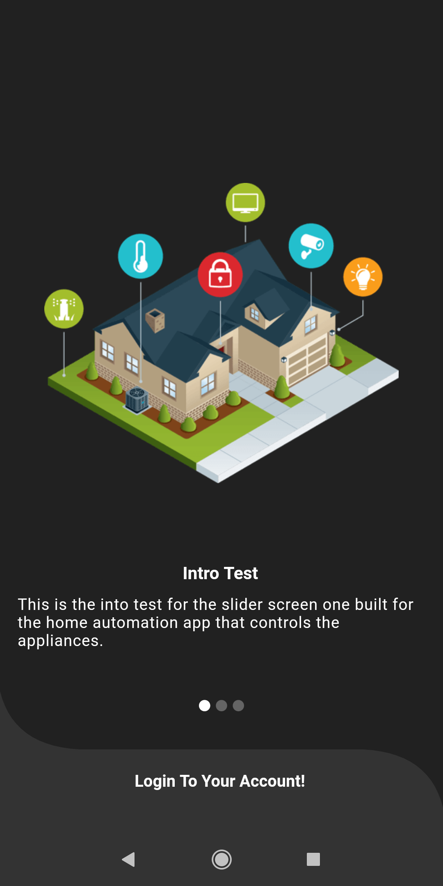</td>
            <td>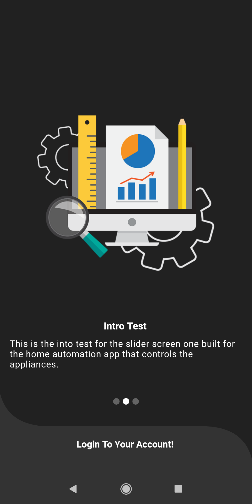</td>
            <td>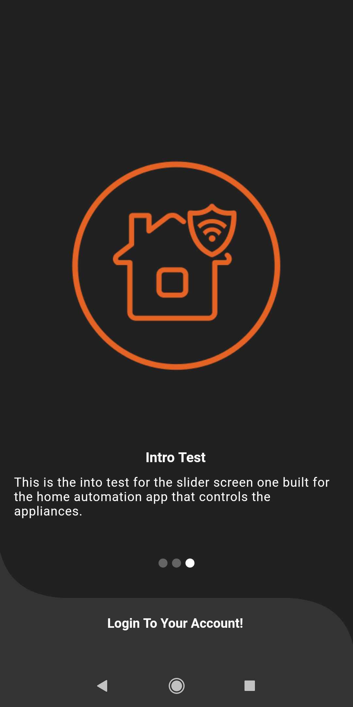</td>
        </tr>
        <tr>
            <td>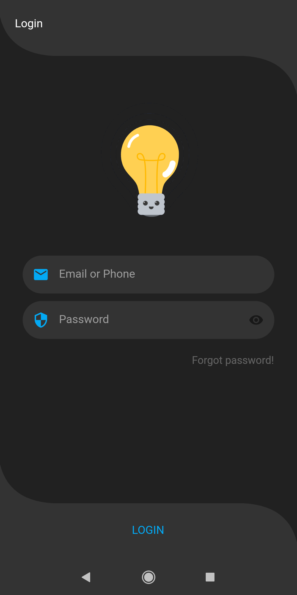</td>
            <td>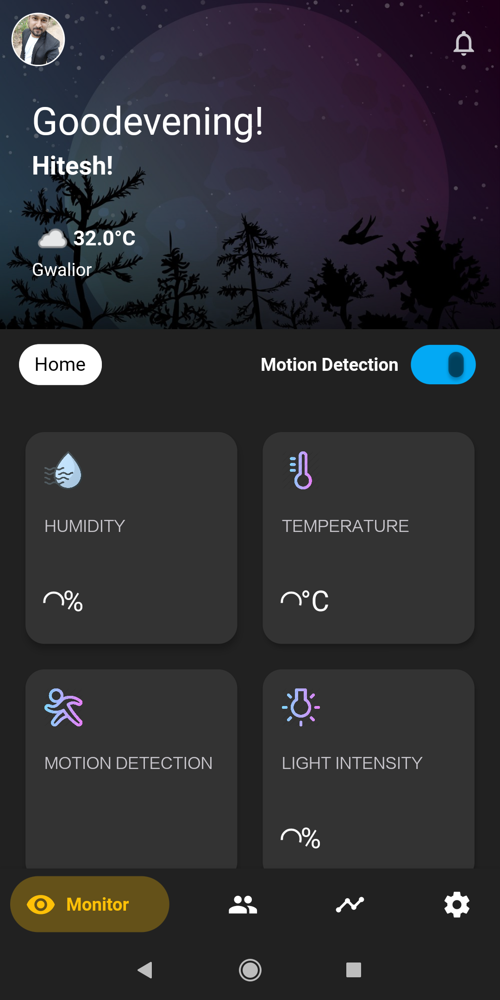</td>
            <td>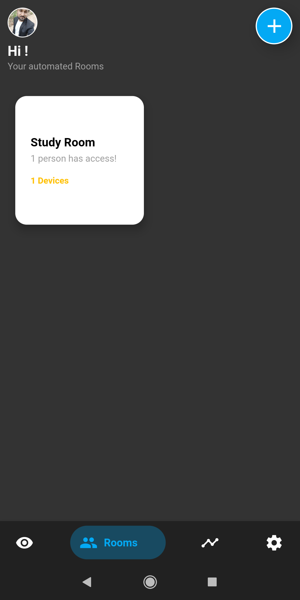</td>
        </tr>
        <tr>
            <td>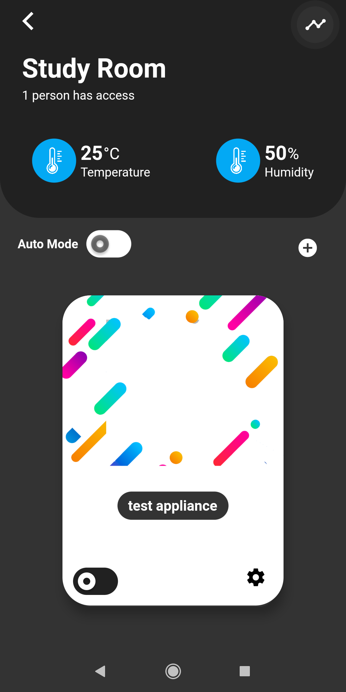</td>
            <td>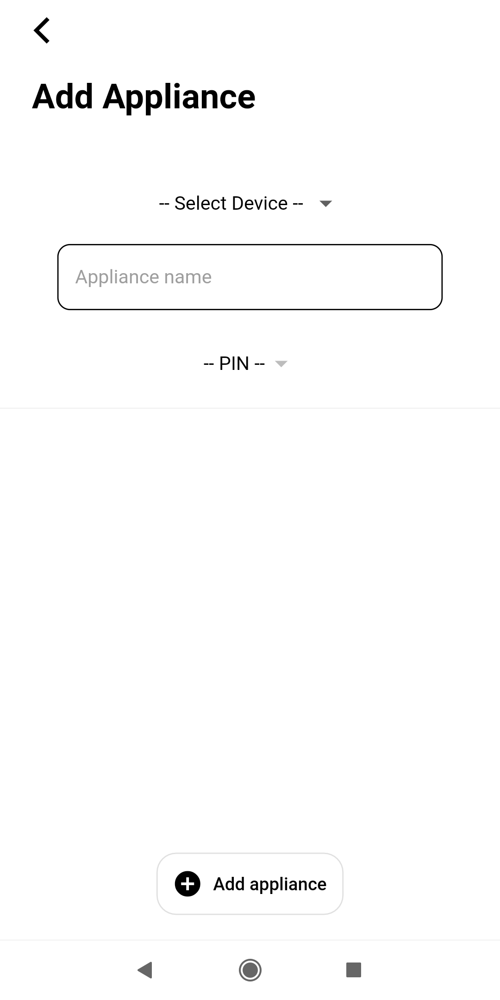</td>
            <td>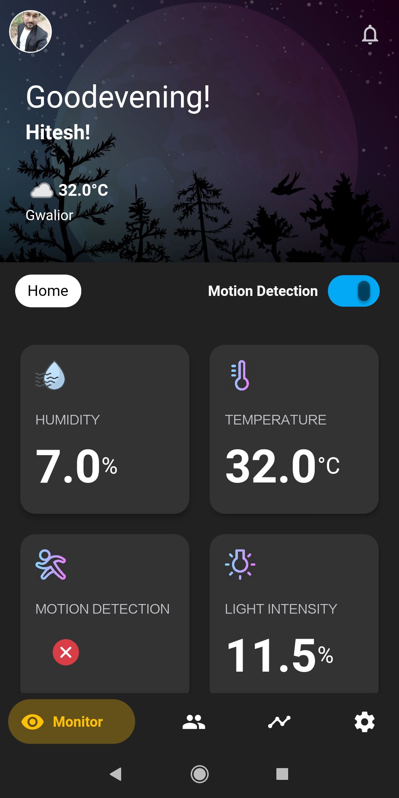</td>
        </tr>
        <tr>
            <td>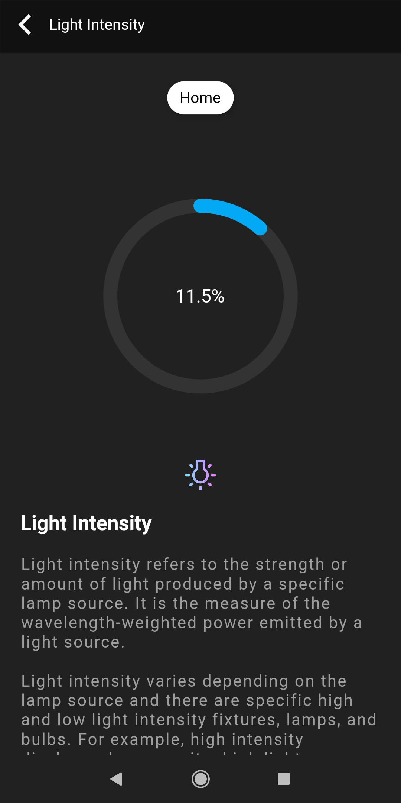</td>
            <td>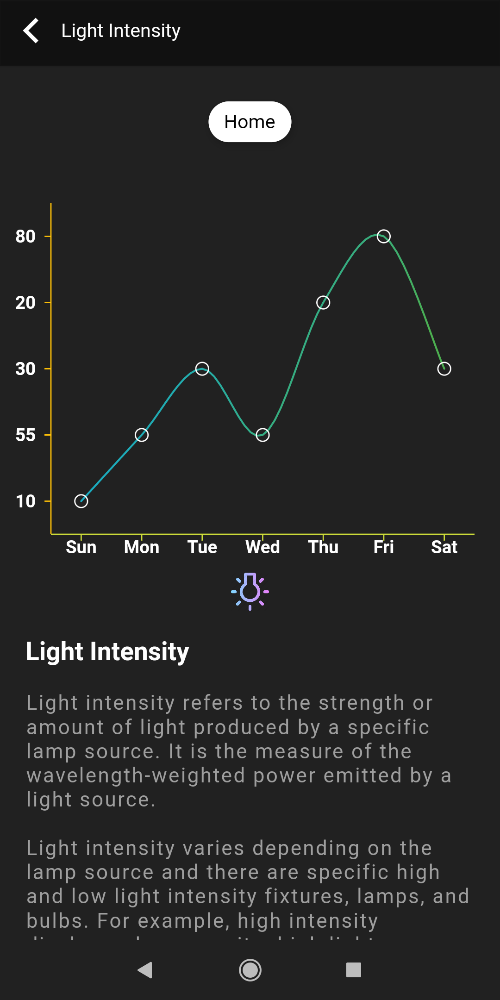</td>
            <td>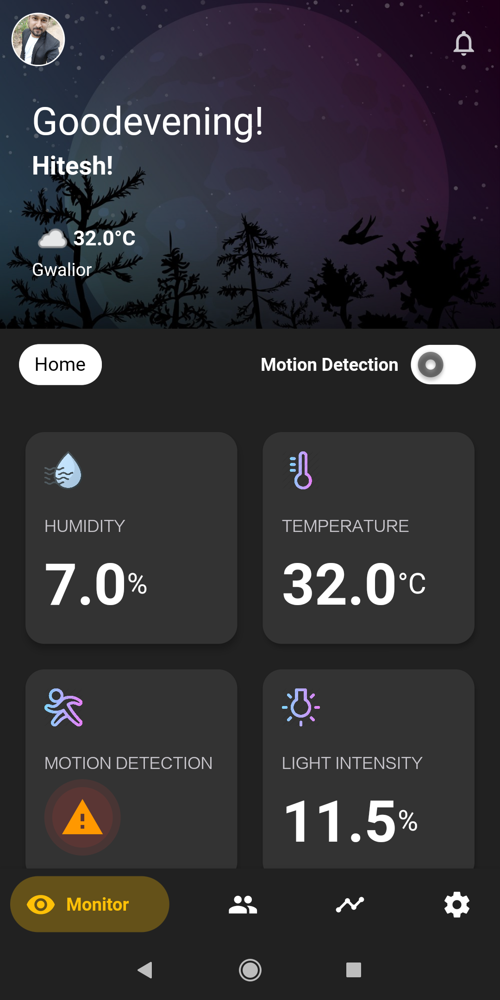</td>
        </tr>
        <tr>
            <td></td>
            <td>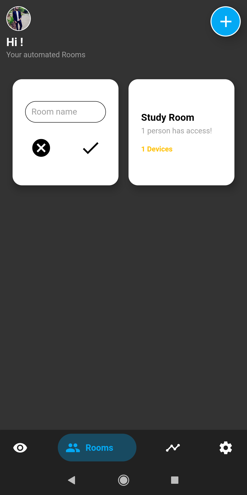</td>
        </tr>
    </table>
</ul>
